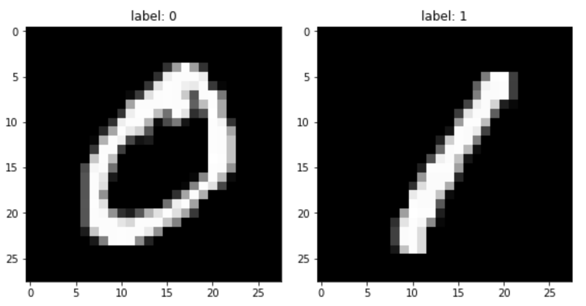
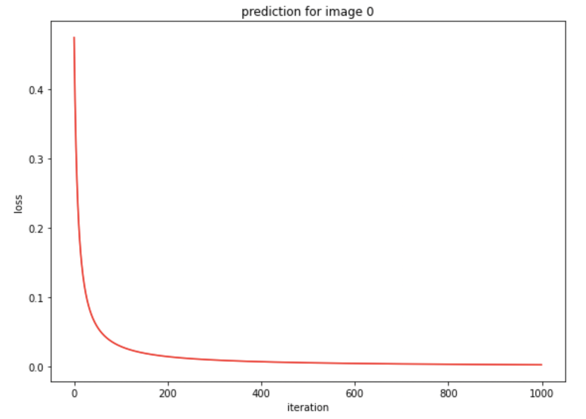

# machine learning project

### 01. Python tutorial and LaTex practice

* Learn usage of basic python syntax, numpy and matplotlib

### 02. Logistic regression for binary classification

* Classify two hand digit images into 0 and 1.

### 03. Logistic regression for binary classification

* Classify multiple hand digit images of 0 and 1.

* testing accuracy at iteration 900 : 1.0000000000

### 04. Classification for multiple classes based on softmax and cross entropy

* Logistic regression for multi-class classification.
* Classify multiple hand digit images of 0, 1, 2, 3 and 4.
* Use One-Hot Encoding.

testing accuracy at iteration 900 : 0.9733333333

### 05. Classification for multiple classes with bias, weight-decay and stochastic gradient descent

* Logistic regression for multi-class classification.
* Classify multiple hand digit images of 0 ~ 9.
* Use One-Hot Encoding.

* testing accuracy (mean) at different mini-batch, weight-decay 0

* testing accuracy (mean) at different weight-decay, mini-batch0

### 06. Classification for multiple classes using Pytorch library

* Multi-class classification based on Softmax and Cross-Entropy using pytorch.
* Classify multiple hand digit images of 0 ~ 9.
* Use multiple layers for neural network.
* best testing (mean) accuracy within the last 10 epochs : 97.7875000000
